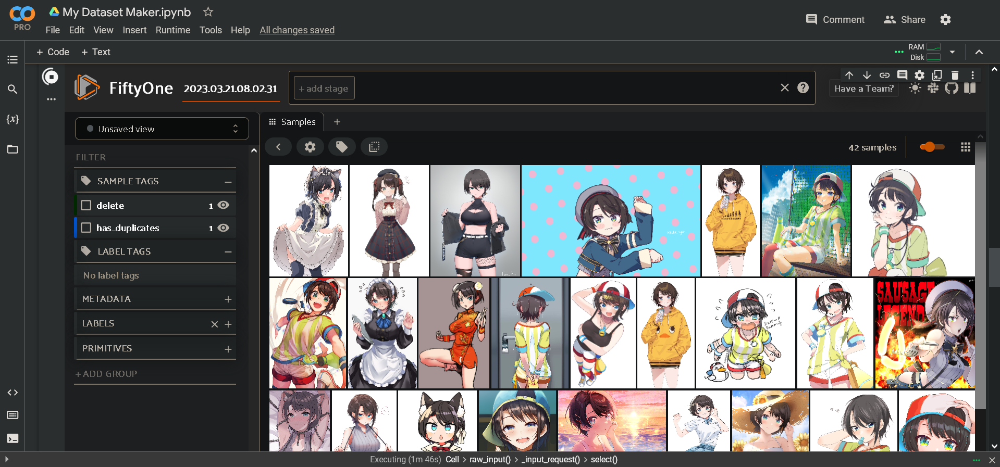

# Kohya Colabs

Accessible Google Colab notebooks for Stable Diffusion Lora training, based on the work of [kohya-ss](https://github.com/kohya-ss/sd-scripts) and [Linaqruf](https://github.com/Linaqruf/kohya-trainer).

If you like my work consider [leaving me a tip](https://ko-fi.com/holostrawberry) :)

| |🇬🇧 English|🇪🇸 Spanish|
|:--|:-:|:-:|
| 📊 **Dataset Maker** |  |  |
| ⭐ **Lora Trainer** |  |  |
| **Lora making Guide** | [Click Here](https://civitai.com/models/22530) | - |
| **Stable Diffusion guide** | [Click Here](https://huggingface.co/hollowstrawberry/stable-diffusion-guide/blob/main/README.md#index) | [Click Aquí](https://huggingface.co/hollowstrawberry/stable-diffusion-guide/blob/main/spanish.md#index) |

### 📊 Dataset Maker - Features

* Able to scrape hundreds of images from the popular anime gallery [Gelbooru](https://gelbooru.com/index.php?page=wiki&s=view&id=18780), that match the conditions set by the user.
* Finds duplicate images using the [FiftyOne](https://docs.voxel51.com/) open-source software.
* Displays the user's dataset back to them through the FiftyOne interface so that they may manually curate their images.
* Able to generate tags for all your anime images using the [Waifu Diffusion 1.4 Tagger](https://huggingface.co/SmilingWolf/wd-v1-4-swinv2-tagger-v2) model.
* Able to generate captions for all your images using the [BLIP](https://huggingface.co/spaces/Salesforce/BLIP) model.
* Gives you the ability to edit hundreds of text files at once, to add/remove/replace tags inside them dynamically.
* Works inside your Google Drive by default.
* Connects easily with Lora Trainer.

### ⭐ Lora Trainer - Features

* Can train LoRA, LoCon and LoHa.
* New feature: [min-snr-gamma](https://arxiv.org/abs/2303.09556), optimizes loss to improve training efficiency.
* One click to install and start training.
* Offers all useful training parameters while keeping it simple and accessible.
* Helpful parameter descriptions and runtime messages.
* Can continue training an existing Lora (though not ideal).
* Advanced features in the form of custom configurations, allowing training with multiple datasets at once and more.
* Uses the latest technologies to load and train quickly.
* Utilizes [kohya-ss scripts](https://github.com/kohya-ss/sd-scripts) as a backend, an industry standard.
* Sources code from [Linaqruf](https://github.com/Linaqruf/kohya-trainer)'s colabs. Thank you!
* Works inside your Google Drive by default.
* Connects easily with Dataset Maker.

&nbsp;

